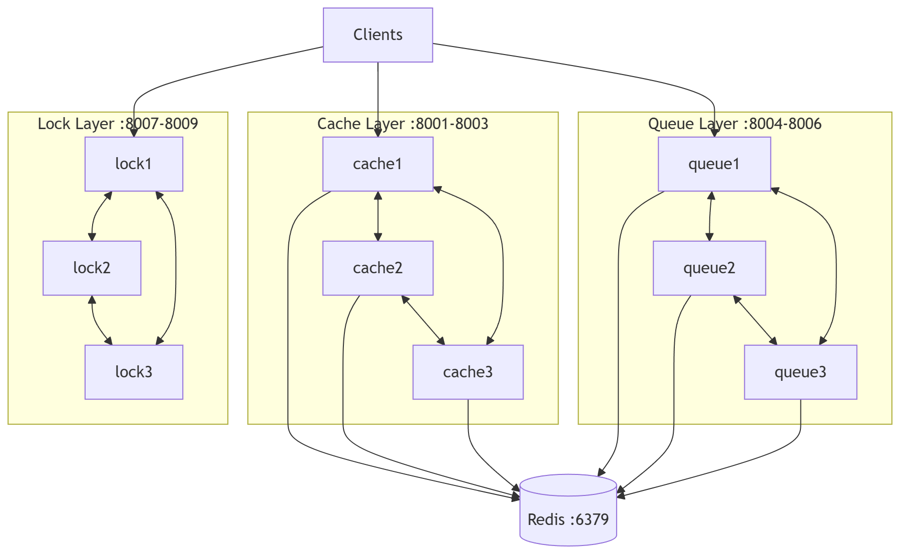

# Arsitektur Distributed Sync System

## 1. Gambaran Umum

Sistem ini adalah platform sinkronisasi terdistribusi berbasis HTTP dengan 3 kapabilitas utama:

1. Distributed cache dengan protokol koherensi gaya MESI.
2. Distributed queue dengan consistent hashing dan mekanisme recovery pekerjaan.
3. Distributed lock manager dengan leader election berbasis Raft sederhana.

Implementasi menggunakan Python, aiohttp untuk API antarnode, Redis sebagai persistent backing store (cache/queue), dan Docker Compose untuk orkestrasi lokal multi-node.

## 2. Komponen Utama

### 2.1 Base Platform

1. BaseNode
   - Lokasi: src/nodes/base_node.py
   - Fungsi:
     - Bootstrap server aiohttp.
     - Endpoint dasar /health dan /message.
     - Middleware CORS global.
     - Memuat env: NODE_ID, PORT, PEERS, REDIS_HOST.
     - Menyediakan antarmuka kirim pesan antarnode via MessageCommunicator.

2. MessageCommunicator
   - Lokasi: src/communication/message_passing.py
   - Fungsi:
     - Mengirim POST HTTP ke endpoint /message node lain.
     - Menjadi lapisan komunikasi point-to-point antarnode.

3. FailureDetector
   - Lokasi: src/communication/failure_detector.py
   - Fungsi:
     - Menyimpan last heartbeat.
     - Menentukan timeout pemilu acak untuk Raft.
     - Menjadi trigger dead leader detection.

### 2.2 Service Node

1. CacheNode
   - Lokasi: src/nodes/cache_node.py
   - Endpoint:
     - POST /cache/set
     - GET /cache/get/{key}
     - GET /cache/metrics
     - POST /mesi/bus
   - Mekanisme:
     - L1 local cache (OrderedDict) dengan LRU eviction.
     - L2 Redis sebagai backing store lintas node.
     - State item: M/S/E/I (implementasi praktis MESI).
     - Bus operation:
       - BusRd untuk read sharing.
       - Invalidate untuk write ownership.

2. QueueNode
   - Lokasi: src/nodes/queue_node.py
   - Endpoint:
     - POST /queue/push
     - GET /queue/pop
     - POST /queue/ack
     - GET /queue/status
   - Mekanisme:
     - Penentuan owner queue via consistent hash ring.
     - Daftar antrean per node: queue:{node_id}.
     - Daftar in-flight per node: processing:{node_id}.
     - Recovery startup: memindahkan job orphan dari processing ke queue.

3. LockManager
   - Lokasi: src/nodes/lock_manager.py
   - Endpoint:
     - POST /lock
     - POST /unlock
     - GET /status
   - Mekanisme:
     - Lock table in-memory per leader.
     - Mendukung lock exclusive dan shared.
     - Penolakan request jika node bukan leader.
     - Integrasi RaftNodeConsensus untuk leader election.

### 2.3 Consensus Layer

1. RaftNodeConsensus
   - Lokasi: src/consensus/raft.py
   - State:
     - Follower
     - Candidate
     - Leader
   - Alur utama:
     - Election timer memicu kandidat.
     - Candidate broadcast RequestVote.
     - Jika mayoritas tercapai, node menjadi leader.
     - Leader broadcast Heartbeat berkala.

## 3. Topologi Arsitektur

## 4. Validasi melalui Test dan Benchmark

1. Unit test konsisten hashing: tests/unit/test_hashing.py.
2. Integration endpoint cache: tests/integration/test_endpoint.py.
3. Load test script async: benchmarks/load_test_scenarios.py.
4. Performance user model Locust: tests/performance/test_performance.py.

## 5. Catatan Batasan Implementasi Saat Ini

1. **Redis Storage**: Hanya Cache dan Queue yang menggunakan Redis. Lock Manager menyimpan state in-memory saja.
2. State lock disimpan in-memory pada leader lock manager; belum ada replikasi log lock state.
3. Implementasi Raft masih minimal (fokus election + heartbeat) dan belum mencakup log replication/commit index.
4. Queue bergantung pada Redis tunggal, sehingga Redis menjadi single point of dependency.

## 6. Ringkasan

Arsitektur sistem menggabungkan pola:

1. Peer-to-peer node communication via HTTP.
2. Shared persistence via Redis.
3. Specialized service role per node type (Cache, Queue, Lock).
4. Consensus-based leadership untuk operasi lock agar write lock terpusat pada leader.

Dengan pendekatan ini, sistem mendukung demonstrasi konsep distributed synchronization end-to-end: konsistensi cache, distribusi pekerjaan, dan koordinasi akses berbasis lock.
